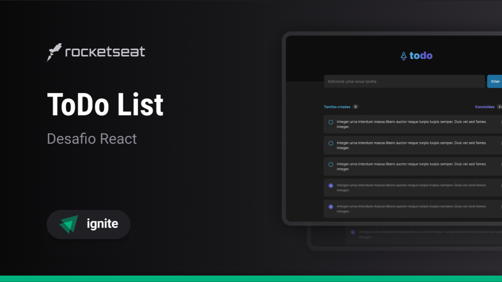

# To-Do List



## Table of Contents

- [About](#about)
- [Getting Started](#getting_started)
- [Usage](#usage)
- [Technologies](#technologies)

## About <a name = "about"></a>
- This is a simple to-do list application that allows you to add, remove and mark tasks as done. It was developed using React.js and css-modules. <br>
 - The app is responsive and can be used on mobile devices. <br>
 - The app already has some tasks added to it, but you can remove them and add your own tasks. You can find this tasks in the file `src/App.tsx`, inside the `tasks` state.

## Getting Started <a name = "getting_started"></a>

These instructions will get you a copy of the project up and running on your local machine for development and testing purposes.

### Prerequisites
- You need to have Node.js installed on your machine. You can download it [here](https://nodejs.org/en/).
- You need to have a package manager installed on your machine. You can use npm or pnpm. In this project, I used pnpm. You can download it using the following command:
```bash
npm install -g pnpm
```

### Installing

A step by step series of examples that tell you how to get a development env running.

1. Clone the repository:
```bash
git clone https://github.com/LeonardoSPereira/To-Do-List
```

2. Install the dependencies:
```bash
pnpm install
```
or 
```bash
npm install
```

## Usage <a name = "usage"></a>

This instructions will help you to run the project on your local machine.

With the dependencies installed, you can run the project using the following command:
```bash
pnpm run dev
```
or
```bash
npm run dev
```

## Technologies <a name = "technologies"></a>
- [React.js](https://reactjs.org/)
- [TypeScript](https://www.typescriptlang.org/)
- [Css-modules](https://github.com/css-modules/css-modules)
- [pnpm](https://pnpm.io/)
- [Vite](https://vitejs.dev/)
- [Phosphor Icons](https://phosphoricons.com/)
